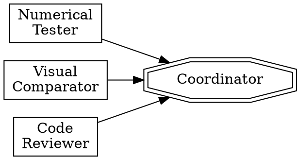

# Multi-Agent Code Review

## Overview

Dispatch 3+ parallel specialist agents to independently verify code correctness, then synthesize results. Designed for validating ports/rewrites where a reference implementation exists.

## When to Use

- Porting code between frameworks (e.g. Taichi -> Warp, NumPy -> JAX)
- Major refactors where original behavior must be preserved
- Any scenario with a reference implementation to compare against

## Agent Roles



| Agent | Responsibility | Output |
|-------|---------------|--------|
| **Numerical Tester** | Run both implementations headless, compare outputs at checkpoints | Max/mean error per step, pass/fail |
| **Visual Comparator** | Render intermediate frames, save side-by-side images | PNG files in `output/`, visual diff report |
| **Code Reviewer** | Line-by-line comparison of kernels, math, data types | Critical issues, warnings, missing features |
| **Coordinator** | Synthesize all findings, make go/no-go decision | Final verdict with evidence |

## Workflow

### 1. Preparation (main context)

Read key files to understand scope. Identify:
- Reference implementation (original)
- Target implementation (port/rewrite)
- Shared config/data files
- Known differences (intentional omissions)

### 2. Dispatch (parallel)

Launch agents 1-3 simultaneously with `run_in_background: true`. Each prompt must include:
- **Exact file paths** for both implementations
- **How to run** (`uv run`, `wp.set_device("cpu")`, etc.)
- **What to compare** (positions, volumes, centroids, etc.)
- **Where to write output** (test files, image dirs)
- **Constraints** ("do NOT modify production code", "code in English")

### 3. Iterate on Failures

Agents may hit errors (wrong attribute names, missing deps, permission issues). **Resume or redo** the agent with fixes. Do not abandon on first failure.

### 4. Synthesize (coordinator)

After all agents complete, compile:
- Numerical: pass/fail per mode, error magnitudes
- Visual: qualitative match, divergence frames
- Code: critical issues, warnings, missing features
- **Root cause** if any test fails (e.g. "GPU race condition in Gauss-Seidel mode")

## Agent Prompt Template

```
You are Agent N: [Role Name].

## Task
[One sentence goal]

## Project
- Directory: [path]
- Reference: [file] (original)
- Target: [file] (port)
- Run with: `uv run python ...`
- Config: [config file path]

## Steps
1. Read [specific files]
2. Write test script to [specific location]
3. Run and capture output
4. Analyze results

## Constraints
- gui=False, render_mode=None (headless)
- [device constraints]
- Code and comments in English

## Output
Return: [exact deliverables]
```

## Key Lessons

1. **Specify device explicitly** - GPU vs CPU can cause completely different results due to race conditions
2. **Test multiple solver modes** - Jacobi (deterministic) and Gauss-Seidel (non-deterministic) may behave differently
3. **Check NaN/Inf early** - Diverging simulations produce NaN within a few steps; detect and report immediately
4. **Shared axis limits** - Visual comparisons need identical scales to be meaningful
5. **Subagents may lack permissions** - If a background agent fails on Write/Bash, redo the work in main context

## Quick Reference: Test Commands

```bash
# Numerical (CPU, both modes)
uv run python tests/test_muscle_warp_vs_taichi.py --mode both --steps 100

# Visual comparison (generates output/*.png)
uv run python tests/test_visual_comparison.py

# GPU stability
uv run python tests/test_warp_cuda_jacobi.py
uv run python tests/test_warp_cpu_vs_cuda.py
```
