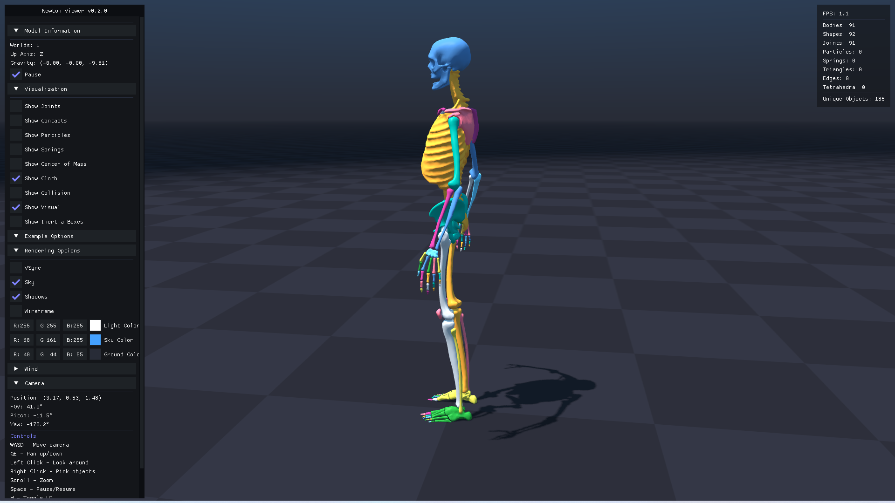
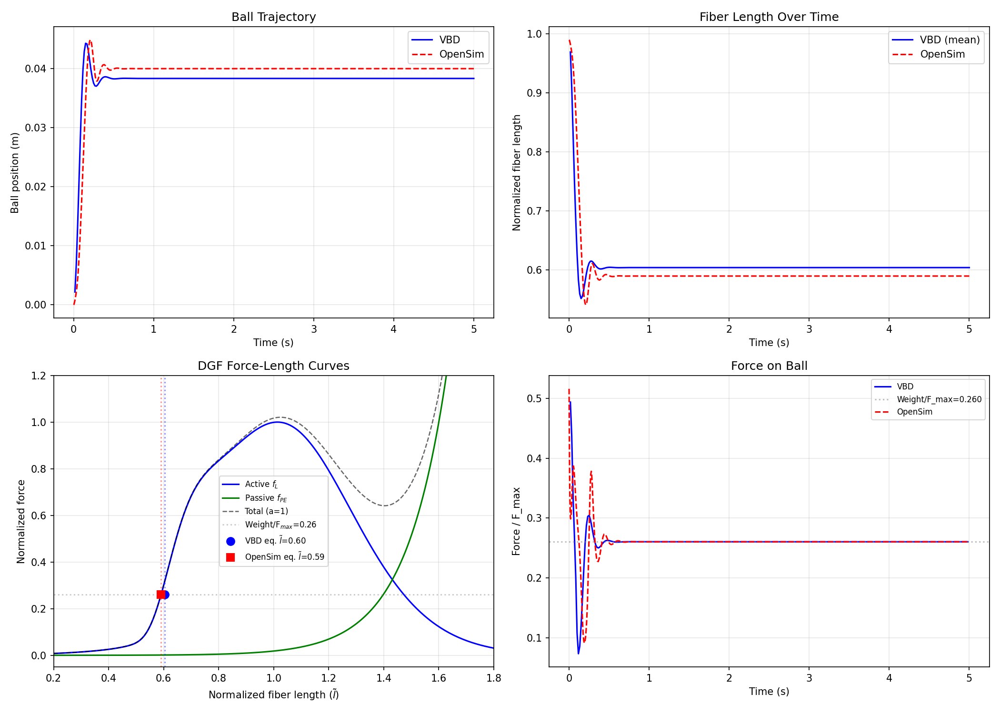
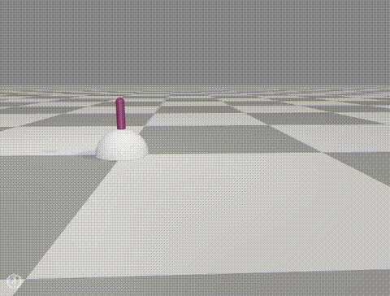
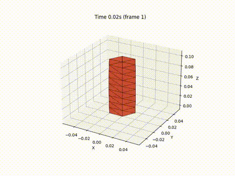
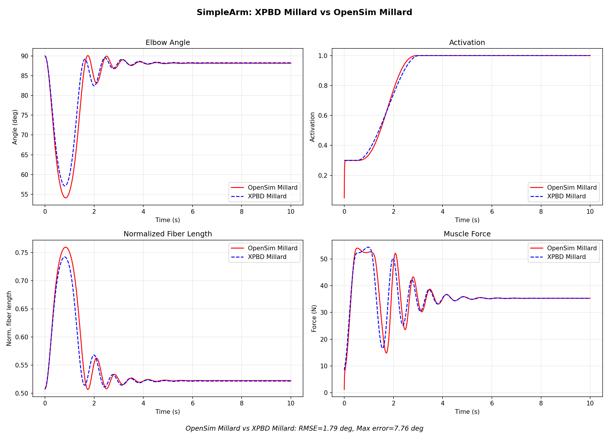

# Train volumetric muscle with reinforcement learning

It is based on NVIDIA's [Newton](https://github.com/newton-physics/newton) physical engine, but with [my own fork](https://github.com/chunleili/newton) so there might be some differences. 

## Install & Run
Firstly, git clone this repo with submodule. 

```
git clone https://github.com/chunleili/RLMuscle 
git submodule update --init --recursive
```

Install [uv](https://docs.astral.sh/uv/getting-started/installation/) with following script:

``` sh
# Linux or macOS
curl -LsSf https://astral.sh/uv/install.sh | sh
# Windows
powershell -ExecutionPolicy ByPass -c "irm https://astral.sh/uv/install.ps1 | iex"
```

Then install the package with:

```
uv sync 
```

or with optional dependencies (for OpenSim comparison):

```
uv sync --extra optional
```

Then run the example with:
```
uv run main.py 
```

(Optional) To run a different example, set environment variable `RUN` or change .env file. The RUN case names are exactly the same as those in `examples/*`. E.g.,
```sh
# linux or macOS
$env:RUN = "exmaple_couple"

# Windows
RUN=exmaple_couple 

uv run main.py 
```

(Optional) You can also use `uv run -m examples.example_XXX` to run an example.


Output (if any) will be saved in the "output" directory.

## Assets download
We use Git LFS to manage large assets. If you have git-lfs installed and LFS smudge is enabled (default), then the assets will be downloaded automatically when you git clone. Otherwise you should first install git lfs run
```
git lfs pull
```

## Roadmap
- physical engine
    - [x] Implement a minimal joint demo using newton
    - [x] USD IO
    - [x] Add muscle coupling solver
    - [x] Register the constitutive model to Hill-type muscle model (DeGrooteFregly2016): sliding ball
- reinforcement learning
    - [ ] Implement a simple RL task (simpleArm)
- final stage
    - [ ] Full body simulation with RL control

## Examples



`uv run -m examples.example_human_import` 

### Sliding Ball Comparison agianst OpenSim
Run the sliding ball muscle experiment and generate force/displacement comparison curves:
```
uv run python scripts/run_sliding_ball_comparison.py
```
Results (plots and data) are saved to `output/`. If `pyopensim` is installed (`uv sync --extra optional`), the script also runs an OpenSim reference simulation for comparison. Sample output plots are shown below:


This example coresponds to a sliding ball lift above by a single muscle.
<p float="left">
  
  
</p>

### Simple Arm Comparison against OpenSim
```
uv run python scripts/run_simple_arm_comparison.py
```



<p float="left">
  <video src="./docs/imgs/simpleArm-osim-motion.mp4" width="47%" autoplay loop muted playsinline></video>
  <video src="./docs/imgs/simpleArm-xpbd-millard.mp4" width="49%" autoplay loop muted playsinline></video>
</p>


## Test
You can run all the tests with:
```
uv run pytest -v
```

Or you can run a specific test file with:
```
uv run python tests/xxx.py
```


## Symbol Table
See [docs/notes/symbols.md](docs/notes/symbols.md) for the unified symbol table used across code and documentation.

## Note

### Layered USD
Use **"--use-layered-usd"** to enable the layered USD export. This is better than the newton's usd viewer because it just adding layers on top of the original usd file, which is the correct way to use usd. So it is incompatible with the "--viewer usd" and has to be used with usd as input. 

You can also specify "--copy-usd" to copy the input usd file to the output directory, which is useful when you want to move and share the usd since the usd use relative path to reference the input usd file.


### Headless mode
You can run the USD IO example in headless mode:
```
.\.venv\Scripts\python.exe examples\example_usd_io.py --viewer null --headless --num-frames 100 --use-layered-usd
```
It will automatically save the layered usd file after 100 frames.

### up-axis
 USD and Houdini use Y up by default. But Newton uses **Z up** by default. See [here](https://newton-physics.github.io/newton/latest/concepts/conventions.html#coordinate-system-and-up-axis-conventions) for newton's convention. We will **transfer the asset to Z up when loading it** (turn off by switching off "y_up_to_z_up"). Be careful when importing other assets.

## macOS Related
If you are simultaneously using Taichi and Warp, you have to first initialize Warp (`wp.init()`) then import Taichi, otherwise their LLVM will conflict with each other.
