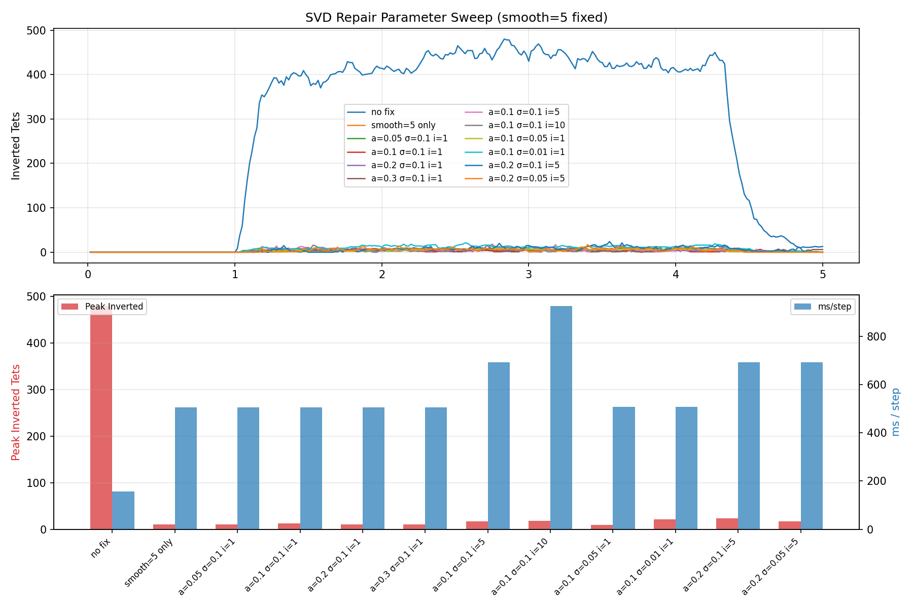

# SVD Repair 参数扫描实验

> 关联文档:
> - [Post-smooth 进展](../progress/2026-04-03-couple3-post-smooth.md)
> - [Mesh 稳定性调查](../progress/2026-04-03-couple3-mesh-stability.md)
> 时间: 2026-04-04
> 状态: 成功

## 目标

在 `post_smooth_iters=5` 固定的基础上，扫描 SVD repair 参数（alpha, sigma_min, iters）的最优组合，同时衡量性能开销。

## 实验设置

- 基础: example_couple3, TETFIBERMILLARD, 300 steps, CPU
- 固定: `post_smooth_iters=5`
- 扫描维度:
  - `repair_alpha` (混合系数): 0.05, 0.1, 0.2, 0.3
  - `repair_sigma_min` (SVD singular value 下限): 0.01, 0.05, 0.1
  - `repair_iters` (SVD 修复迭代数): 1, 5, 10

### 复现命令

```bash
uv run python scripts/experiments/sweep_post_smooth.py
```

## 结果

| 配置 | Peak 反转 | Worst det(F) | 恢复 (End) | ms/step | Overhead |
|------|:---:|:---:|:---:|:---:|:---:|
| no fix | 480 | -927.28 | 19 | 156 | 基准 |
| smooth=5 only | 10 | -2.48 | 1 | 506 | +224% |
| a=0.05 σ=0.1 i=1 | 10 | -2.48 | 1 | 506 | +224% |
| a=0.1 σ=0.1 i=1 | 13 | -2.02 | 0 | 506 | +224% |
| **a=0.2 σ=0.1 i=1** | **10** | **-1.40** | **0** | **505** | **+224%** |
| a=0.3 σ=0.1 i=1 | 10 | -1.90 | 3 | 506 | +224% |
| a=0.1 σ=0.1 i=5 | 17 | -2.25 | 0 | 692 | +344% |
| a=0.1 σ=0.1 i=10 | 18 | -2.15 | 0 | 926 | +493% |
| **a=0.1 σ=0.05 i=1** | **9** | **-0.54** | **1** | **506** | **+224%** |
| a=0.1 σ=0.01 i=1 | 21 | -1.80 | 1 | 507 | +225% |
| a=0.2 σ=0.1 i=5 | 24 | -1.33 | 3 | 693 | +344% |
| a=0.2 σ=0.05 i=5 | 17 | -2.07 | 0 | 693 | +344% |



## 分析

### 1. SVD repair iters=1 几乎零额外开销
- smooth=5 已占据全部 overhead（+224%），SVD i=1 在此基础上增加 <1ms
- 因为单轮 SVD clamp 只遍历 3938 tets 一次，相对 5 轮 post-smooth（每轮 ~12000 约束）可忽略

### 2. 增加 repair_iters 性价比极差
- i=5: +344% overhead，但 peak 反而从 10 增到 17（更差！）
- i=10: +493% overhead，peak=18
- 原因：多轮 SVD 修正会扰乱邻居 tet 的 det(F)，形成振荡

### 3. sigma_min 是最关键参数
- σ=0.1（默认）：修正所有 singular value < 0.1 的 tet → peak=10-13
- **σ=0.05**：更精准，只修正严重退化的 tet → **peak=9, worst_det=-0.54**（最优）
- σ=0.01：太保守，大部分接近反转的 tet 不被修正 → peak=21

### 4. alpha=0.2-0.3 时 recovery 可能变差
- a=0.3 End=3（部分 tet 恢复变慢）
- a=0.2 i=5 End=3
- a=0.1-0.2 i=1 表现最稳

### 5. 之前也测试了 fiber kernel 内 skip（跳过 det(F)<threshold 的 tet 不解 fiber 约束）
结果无效，因为问题 tet 已经反转，跳过 fiber 约束对邻居的挤压无帮助。

## 追加实验: alpha=0.2 + 小 sigma_min

| 配置 | Peak 反转 | Worst det(F) | 恢复 (End) |
|------|:---:|:---:|:---:|
| a=0.1 σ=0.05 i=1 (ref) | 9 | -0.54 | 1 |
| a=0.2 σ=0.05 i=1 | 11 | -1.62 | 0 |
| a=0.2 σ=0.01 i=1 | 16 | -1.27 | 0 |

alpha=0.2 修正力度过大，peak 反而升高。**a=0.1 σ=0.05 i=1 确认为最优**。

## 结论

### 性价比最优方案
`smooth=5 + SVD(alpha=0.1, sigma_min=0.05, iters=1)`
- Peak 反转: 9 (0.23%)
- Worst det(F): -0.54
- 完全恢复: End=1
- 性能开销: +224%（全部来自 smooth=5，SVD 零额外开销）

### 对比历史

| 方案 | Peak 反转 | Worst det(F) | 恢复 | Overhead |
|------|:---:|:---:|:---:|:---:|
| 无修复 | 480 (12.2%) | -927 | 19 永久 | 0% |
| smooth=3 (初版) | 62 (1.5%) | -5.09 | 1 | ~+135% |
| smooth=5 | 10 (0.25%) | -2.48 | 1 | +224% |
| **smooth=5 + SVD最优** | **9 (0.23%)** | **-0.54** | **1** | **+224%** |

## 最终默认配置

已写入 `data/muscle/config/bicep_fibermillard_coupled.json`：
```json
"post_smooth_iters": 5,
"repair_alpha": 0.1,
"repair_iters": 1,
"repair_sigma_min": 0.05
```

### 复现最终结果
```bash
uv run python examples/example_couple3.py --auto --steps 300 --no-usd
uv run python scripts/run_couple3_curves.py
```

### 输出文件
- 曲线图: `output/couple3_curves.png`
- 参数扫描图: `output/sweep_post_smooth.png`
- USD 动画: `output/example_couple3.anim.usd`

## 涉及文件

- 扫描脚本: `scripts/experiments/sweep_post_smooth.py`
- 绘图脚本: `scripts/run_couple3_curves.py`
- Config: `data/muscle/config/bicep_fibermillard_coupled.json`
- Git tag: `couple3-bicep`
- Commit: `00569ce`
