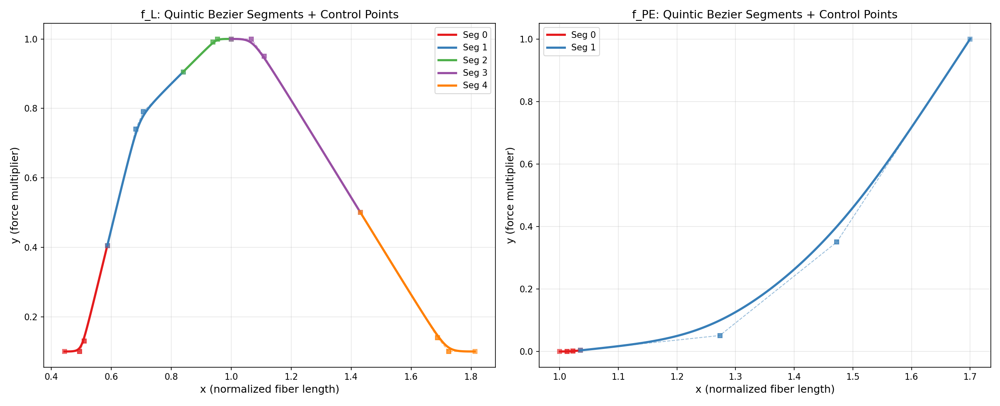
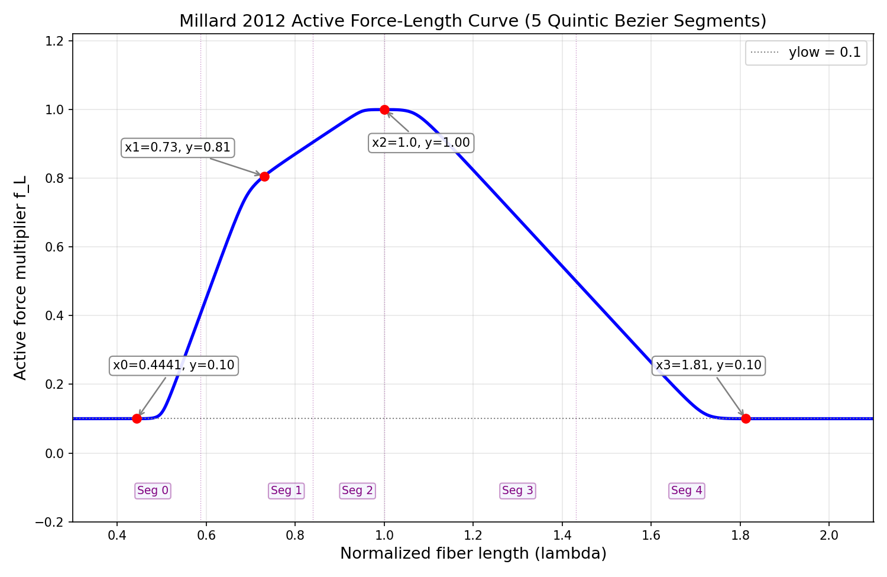
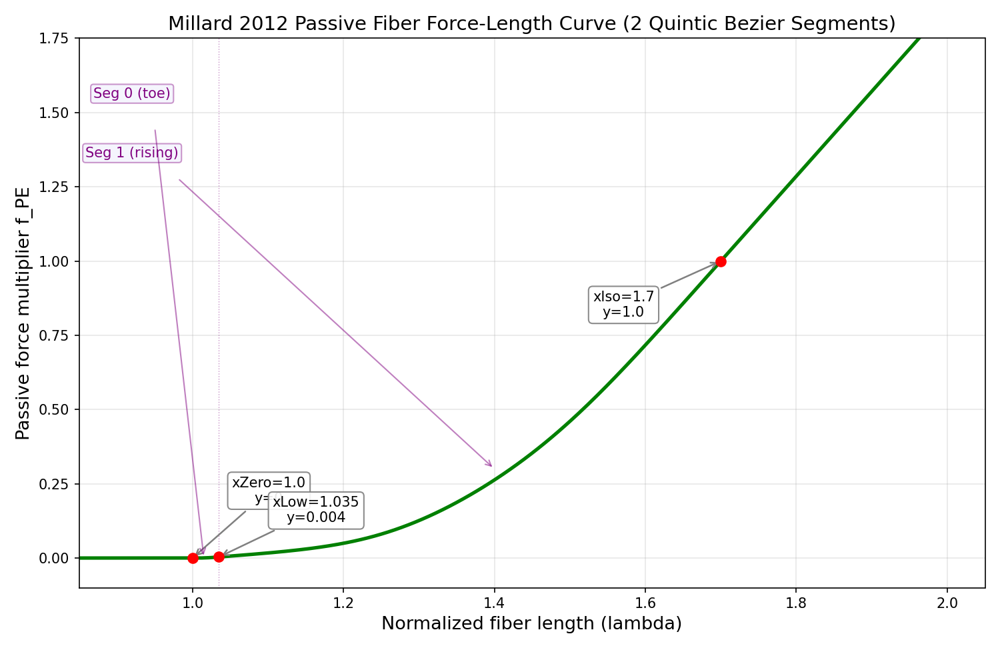
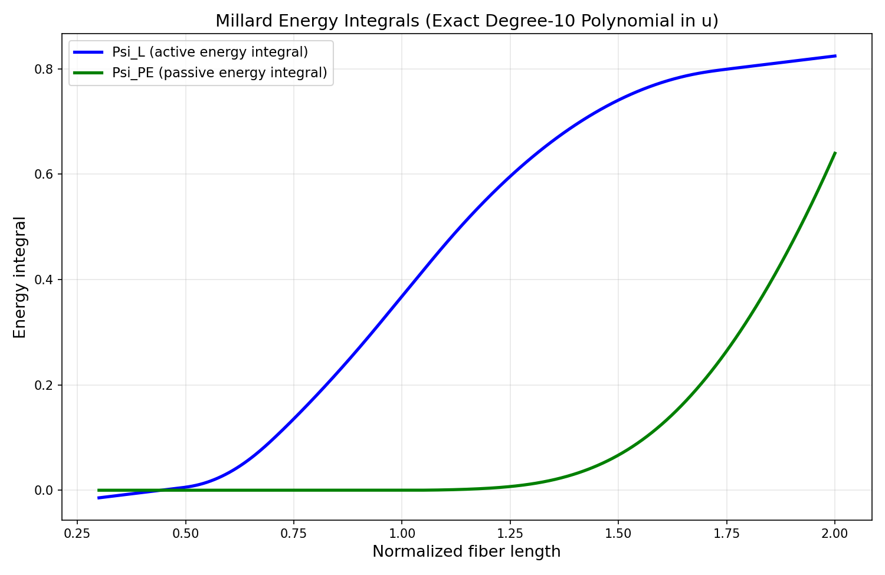

# Millard 2012 肌肉曲线原理与实现

> 参考: Millard et al. (2013), "Flexing Computational Muscle: Modeling and Simulation
> of Musculotendon Dynamics", ASME J. Biomech. Eng. 135(2):021005.
>
> OpenSim 源码: `SmoothSegmentedFunctionFactory.cpp`, `SegmentedQuinticBezierToolkit.cpp`

## 1. 概述

Millard 2012 模型使用 **分段 quintic Bezier 样条** 定义肌肉的力-长度（和力-速度）关系。与 DeGroote-Fregly (DGF) 模型的三高斯拟合不同，Bezier 样条具有精确的多项式表达式，使得：

- 力函数 f(λ) 可精确求值（无需 exp/log）
- 能量积分 Ψ(λ) = ∫f ds 有 **闭式解**（10次多项式）
- GPU 上高效执行（Newton 迭代 + Horner 求值）

### 两条核心曲线

| 曲线 | 含义 | 段数 | 定义域 |
|------|------|------|--------|
| f_L(λ) | 主动力-长度曲线 | 5 段 | [0.4441, 1.8123] |
| f_PE(λ) | 被动力-长度曲线 | 2 段 | [1.0, 1.7] |

其中 λ = 当前纤维长度 / 最优纤维长度（归一化纤维长度）。

---

## 2. Quintic Bezier 基础

> **Quintic = 五次多项式（degree 5）**。Bezier 曲线按次数命名：Cubic(3次/4控制点)、Quartic(4次/5控制点)、**Quintic(5次/6控制点)**。OpenSim 选用 quintic 是因为 6 个控制点中 P1=P2、P3=P4（doubled），在保证 C¹ 连续的同时，留出一个 curviness 自由度控制弯曲程度——这是 cubic 做不到的。

### 2.1 参数形式

每段 Bezier 曲线由 6 个控制点 `(Px[0..5], Py[0..5])` 定义，参数 `u ∈ [0,1]`：

```
x(u) = Σ_{j=0}^{5} Px[j] · B_j^5(u)
y(u) = Σ_{j=0}^{5} Py[j] · B_j^5(u)
```

其中 Bernstein 基函数：

```
B_j^5(u) = C(5,j) · u^j · (1-u)^{5-j}

B_0 = (1-u)^5
B_1 = 5u(1-u)^4
B_2 = 10u^2(1-u)^3
B_3 = 10u^3(1-u)^2
B_4 = 5u^4(1-u)
B_5 = u^5
```

### 2.2 控制点计算（Corner Algorithm）

OpenSim 使用 `calcQuinticBezierCornerControlPoints` 算法，给定两端点的位置和斜率，生成一个 C 形弯角的 6 个控制点：

**输入**: `(x0, y0, dydx0)` → `(x1, y1, dydx1)`, curviness `c ∈ [0,1]`

```python
# Step 1: curviness 缩放到 [0.1, 0.9]
c_scaled = 0.1 + 0.8 * c

# Step 2: 两条切线的交点
if |dydx0 - dydx1| > √eps:
    xC = (y1 - y0 - x1*dydx1 + x0*dydx0) / (dydx0 - dydx1)
else:
    xC = (x1 + x0) / 2
yC = (xC - x1) * dydx1 + y1

# Step 3: 中间控制点（doubled for C1 continuity）
x0_mid = x0 + c_scaled * (xC - x0)
y0_mid = y0 + c_scaled * (yC - y0)
x1_mid = x1 + c_scaled * (xC - x1)
y1_mid = y1 + c_scaled * (yC - y1)

# Step 4: 6 个控制点
Px = [x0, x0_mid, x0_mid, x1_mid, x1_mid, x1]
Py = [y0, y0_mid, y0_mid, y1_mid, y1_mid, y1]
```

注意 `Px[1]=Px[2]` 和 `Px[3]=Px[4]`（doubled），这保证了 C¹ 连续性。curviness 控制曲线向角点弯曲的程度：0 → 接近直线，1 → 紧贴切线交点。



---

## 3. 主动力-长度曲线 f_L(λ)

### 3.1 默认参数

| 参数 | 值 | 含义 |
|------|-----|------|
| x0 | 0.4441 | 最短有效纤维长度（左肩） |
| x1 | 0.73 | ascending limb 过渡点 |
| x2 | 1.0 | 峰值（最优长度，f_L = 1.0） |
| x3 | 1.8123 | 最长有效纤维长度（右肩） |
| ylow | 0.1 | 肩部最小值（防止除零奇异性） |
| dydx | 0.8616 | 浅升斜率（plateau 区域） |
| curviness | 1.0 | 弯曲度（缩放后为 0.9） |

### 3.2 中间点计算

```python
xDelta = 0.05 * x2          # = 0.05, 半肌节宽度
xs = x2 - xDelta            # = 0.95, 峰值左侧肩部

# Ascending limb
y1 = 1.0 - dydx * (xs - x1) # ≈ 0.810
dydx01 = 1.25 * y1 / (x1 - x0)  # 上升段斜率
x01 = x0 + 0.5*(x1-x0)     # = 0.587, 中间连接点
y01 = 0.5 * y1              # ≈ 0.405

# Plateau
x1s = x1 + 0.5*(xs - x1)    # = 0.84
y1s = y1 + 0.5*(1.0 - y1)   # ≈ 0.905
dydx1s = dydx               # 0.8616

# Peak
y2 = 1.0, dydx2 = 0.0

# Descending limb
x23 = (x2+xDelta) + 0.5*(x3-(x2+xDelta))  # ≈ 1.431
y23 = 0.5                   # 中点
dydx23 = -1/(x3-xDelta-(x2+xDelta))        # ≈ -1.404
```

### 3.3 五段 Bezier

| 段 | 起点 (x, y, slope) | 终点 (x, y, slope) | 描述 |
|----|--------------------|--------------------|------|
| 0 | (0.4441, 0.1, 0) | (0.587, 0.405, 3.54) | 左肩→上升 |
| 1 | (0.587, 0.405, 3.54) | (0.84, 0.905, 0.86) | 上升→平台 |
| 2 | (0.84, 0.905, 0.86) | (1.0, 1.0, 0) | 平台→峰值 |
| 3 | (1.0, 1.0, 0) | (1.431, 0.5, -1.40) | 峰值→下降 |
| 4 | (1.431, 0.5, -1.40) | (1.8123, 0.1, 0) | 下降→右肩 |



---

## 4. 被动力-长度曲线 f_PE(λ)

### 4.1 默认参数

| 参数 | 值 | 含义 |
|------|-----|------|
| e_zero | 0.0 | 开始产生力的 strain（λ=1.0 时） |
| e_iso | 0.7 | 归一化力=1.0 时的 strain（λ=1.7） |
| k_low | 0.2 | 低力区域斜率 |
| k_iso | 2.857 | 归一化力=1.0 处的斜率 |
| curviness | 0.75 | 弯曲度（缩放后为 0.7） |

### 4.2 中间点计算

```python
xZero = 1.0 + e_zero       # = 1.0
xIso = 1.0 + e_iso         # = 1.7

deltaX = min(0.1/k_iso, 0.1*(xIso-xZero))  # = 0.035
xLow = xZero + deltaX      # = 1.035
xfoot = xZero + 0.5*deltaX # = 1.0175
yLow = k_low * (xLow - xfoot)  # = 0.0035
```

### 4.3 两段 Bezier

| 段 | 起点 (x, y, slope) | 终点 (x, y, slope) | 描述 |
|----|--------------------|--------------------|------|
| 0 | (1.0, 0, 0) | (1.035, 0.0035, 0.2) | toe 区域 |
| 1 | (1.035, 0.0035, 0.2) | (1.7, 1.0, 2.857) | 线性上升 |

域外行为：λ ≤ 1.0 时 f_PE = 0；λ > 1.7 时线性外推（斜率 k_iso）。



---

## 5. 多项式转换与能量积分

### 5.1 Bernstein → 幂基

将 6 个 Bezier 控制点转换为标准多项式系数 `c[0..5]`，使得：

```
f(u) = c[0] + c[1]·u + c[2]·u² + c[3]·u³ + c[4]·u⁴ + c[5]·u⁵
```

转换矩阵 M（Bernstein-to-power，degree 5）：

```
M = [  1    0    0    0    0   0 ]   u⁰
    [ -5    5    0    0    0   0 ]   u¹
    [ 10  -20   10    0    0   0 ]   u²
    [-10   30  -30   10    0   0 ]   u³
    [  5  -20   30  -20    5   0 ]   u⁴
    [ -1    5  -10   10   -5   1 ]   u⁵

coeffs = M @ control_points
```

对 x(u) 和 y(u) 分别做此转换，得到两组 6 维系数向量。

### 5.2 能量积分闭式

能量密度定义为力的积分：

```
Ψ(λ) = ∫ f(λ) dλ
```

在参数空间中：

```
F(u) = ∫₀ᵘ y(t) · x'(t) dt
```

由于：
- y(u) 是 **5 次**多项式
- x'(u) 是 **4 次**多项式
- 乘积 y·x' 是 **9 次**多项式
- 不定积分 F(u) 是 **10 次**多项式

**全部系数可精确计算**，无需数值积分。

```python
# x'(u) = Σ_{k=1}^{5} k · x_coeffs[k] · u^{k-1}
xp_coeffs = [k * x_coeffs[k] for k in range(1, 6)]

# y(u) · x'(u) = 卷积（多项式乘法）
product = convolve(y_coeffs, xp_coeffs)  # 10 项

# F(u) = ∫₀ᵘ product(t) dt
F_coeffs[k+1] = product[k] / (k+1)      # 11 项, F[0]=0
```



---

## 6. GPU 求值 Pipeline

### 6.1 初始化（一次性，CPU 端）

```
┌─────────────────────────────────────────────────┐
│ MillardCurves()                                 │
│                                                 │
│ 1. OpenSim 控制点算法                            │
│    ├─ build_active_fl_bezier() → 5×(Px[6],Py[6])│
│    └─ build_passive_fpe_bezier() → 2×(Px[6],Py[6])│
│                                                 │
│ 2. Bernstein → 幂基转换                          │
│    ├─ x_coeffs[6] = M @ Px   (per segment)     │
│    └─ y_coeffs[6] = M @ Py                     │
│                                                 │
│ 3. 能量积分系数                                   │
│    └─ F_coeffs[11] = ∫₀ᵘ y·x' dt               │
│                                                 │
│ 4. 上传到 GPU                                    │
│    ├─ wp.array: x_coeffs (n_seg×6, float32)     │
│    ├─ wp.array: y_coeffs (n_seg×6, float32)     │
│    ├─ wp.array: seg_bounds (n_seg+1, float32)   │
│    └─ 标量: x_lo, x_hi, y_lo, y_hi, dydx_lo/hi │
└─────────────────────────────────────────────────┘
```

### 6.2 GPU 求值（每 tet 每 substep）

```
Input: lm_tilde (当前归一化纤维长度)

┌─────────────────────────────────────────────┐
│ millard_eval_wp(lm_tilde, ...)              │
│                                             │
│ 1. 域外检查                                  │
│    if lm < x_lo: return y_lo (线性外推)      │
│    if lm > x_hi: return y_hi (线性外推)      │
│                                             │
│ 2. 线性扫描找段 (≤5 次比较)                   │
│    for i in range(n_seg):                   │
│      if lm <= seg_bounds[i+1]: seg = i      │
│                                             │
│ 3. Newton 迭代 x→u (3-5步, ~50 FLOPs)       │
│    读取 x_coeffs[seg*6 : seg*6+6]           │
│    u₀ = (lm - x(0)) / (x(1) - x(0))       │
│    loop 5 times:                            │
│      u -= (x(u) - lm) / x'(u)              │
│                                             │
│ 4. Horner 求值 y(u) (~10 FLOPs)             │
│    读取 y_coeffs[seg*6 : seg*6+6]           │
│    return c0 + u*(c1 + u*(c2 + u*(c3 + u*(c4 + u*c5))))│
│                                             │
│ 总计: ~70 FLOPs/tet (vs DGF 3×exp ≈ 60-90) │
└─────────────────────────────────────────────┘
```

### 6.3 XPBD 约束求解 Pipeline

```
每步 (step):
  CPU: activation dynamics → a(t)
  CPU: Millard 平衡反求 → contraction_factor
       (bisection on ascending limb: a·f_L(lm) = normalized_load)
  GPU: update contraction_factor in constraint restdir[1]

每 substep:
  GPU: integrate → clear → solve_constraints → update_vel

solve_tetfibermillard_kernel (per tet):
  1. 变形梯度 F = Ds · Dm⁻¹
  2. 纤维拉伸 λ = ||F·w|| (w = 材料空间纤维方向)
  3. Millard 曲线求值:
     f_L = millard_eval_wp(λ, fl_data...)
     f_PE = millard_eval_wp(λ, fpe_data...)
  4. 合力: f_total = a·f_L + f_PE
  5. 刚度调制: k = k_base · max(f_total, 0.01) · scale
  6. 目标拉伸: target = 1 - a · contraction_factor
  7. XPBD 约束更新: C = ||F·w|| - target, Δλ = -C/(w_sum + α)
```

---

## 7. 与 DGF 模型的关键差异

| 特性 | Millard 2012 | DGF 2016 |
|------|-------------|----------|
| f_L 基函数 | 分段 quintic Bezier | 3 个可变宽度高斯 |
| f_L 肩部值 | ylow = 0.1（非零） | ≈ 0（趋近零） |
| f_PE 基函数 | 分段 quintic Bezier | 指数函数 |
| f_PE 增长 | 线性外推（λ>1.7） | 指数增长（无界） |
| 能量积分 | **闭式**（10次多项式） | 需数值积分（Gauss-Legendre） |
| GPU 开销 | ~70 FLOPs (Newton+Horner) | ~60-90 FLOPs (3×exp) |
| 参数可调性 | 控制点+curviness | 6个固定系数 |

### f_L 形状差异

Millard 的 ascending limb 更陡峭，导致在相同激活和载荷下，平衡纤维长度更短：

```
Sliding ball (a=1, ball=10kg):
  Millard: λ_eq = 0.55
  DGF:     λ_eq = 0.59
```

---

## 8. 验证结果

### Sliding Ball (XPBD-Millard vs OpenSim-Millard)

| 指标 | XPBD | OpenSim | 误差 |
|------|------|---------|------|
| λ_eq | 0.5498 | 0.5461 | 0.7% |
| 球位置 | 0.0449m | 0.0444m | 1.2% |

### Simple Arm (XPBD-Millard vs OpenSim-Millard)

| 指标 | XPBD | OpenSim | 差异 |
|------|------|---------|------|
| 稳态肘角 | 88.25° | 88.15° | 0.10° |

---

## 9. 代码位置

| 文件 | 内容 |
|------|------|
| `src/VMuscle/millard_curves.py` | 曲线构造、多项式转换、CPU 求值、平衡反求 |
| `src/VMuscle/muscle_warp.py` | GPU 求值函数 `millard_eval_wp`、约束内核 `solve_tetfibermillard_kernel` |
| `src/VMuscle/constraints.py` | 约束类型 `TETFIBERMILLARD`、构建器 |
| `tests/test_millard_curves.py` | 25 项单元测试 |
| `tests/test_millard_gpu.py` | GPU/CPU 一致性测试 |

## 10. 参考文献

1. Millard, M., Uchida, T., Seth, A., Delp, S.L. (2013). "Flexing computational muscle: modeling and simulation of musculotendon dynamics." *ASME J. Biomech. Eng.* 135(2):021005.
2. OpenSim source: `SmoothSegmentedFunctionFactory.cpp`, `SegmentedQuinticBezierToolkit.cpp`
3. DeGroote, F. et al. (2016). "Evaluation of direct collocation optimal control problem formulations for solving the muscle redundancy problem." *Annals of Biomed. Eng.* 44(10):2922-2936.
