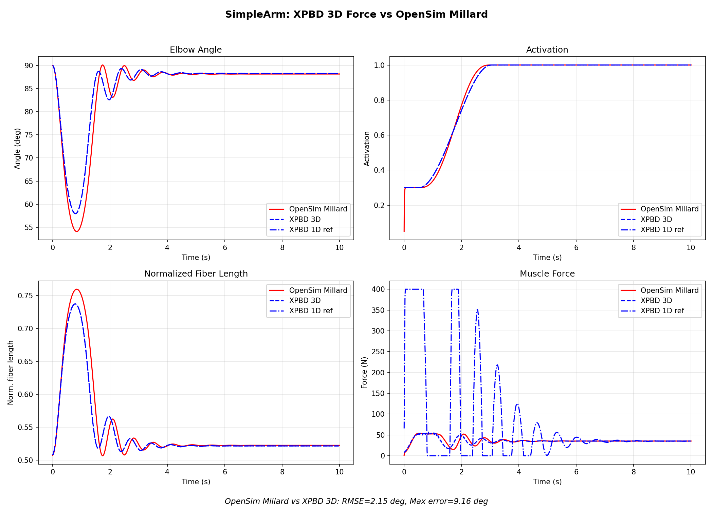

# 3D Force Feedback: XPBD → MuJoCo 耦合修复

**日期**: 2026-04-03  
**分支**: fix/3d-force  
**计划**: docs/plans/2026-04-03-3d-force-feedback.md

## 问题

`example_xpbd_coupled_simple_arm_millard.py` 中的 "XPBD vs OpenSim" 对比曲线
虚假地完美匹配，因为驱动 MuJoCo 关节的力来自独立的 1D Hill 公式，
而非 3D XPBD mesh 的反力。XPBD mesh 只是被骨骼拖着走的装饰品。

## 完成的修复

### 1. 力提取基础设施 (`muscle_warp.py`)

- 添加 `save_predicted_positions(vertex_ids)` — 在 integrate 后、solve 前保存预测位置
- 添加 `get_insertion_force(insertion_vids, dts)` — 通过对比预测位置和校正位置，
  计算约束对 insertion 端顶点的净校正力，取反得到肌肉对 bone 的反力

### 2. f_V (force-velocity) 加入 active fiber kernel (`muscle_warp.py`)

`accumulate_active_fiber_force_kernel` 中新增：
- `vel` 参数：读取每个 tet 的顶点速度
- 从速度边矩阵 `Ds_dot` 计算 per-tet 纤维速度：`dlm_dt = dot(n, Ds_dot @ w)`
- 归一化：`v_norm = dlm_dt / (V_max * lambda_opt)`
- 调用已有的 `dgf_force_velocity_wp(v_norm)` 计算 f_V
- 完整应力公式：`tau = sigma0 * (a * f_L(r) * f_V(v_norm) + d_damp * v_norm)`

新增 `from_procedural` 参数：`v_max_norm`, `d_damp`

### 3. Mesh 几何跟踪 (`example_xpbd_coupled_simple_arm_millard.py`)

发现 mesh 的 bone targets 使用固定 `mesh_length` 放置，导致 mesh 无法随
关节角度拉伸。修改为：
- `cur_fiber_length = path_length - L_slack`（刚性肌腱假设）
- targets 沿纤维方向按 `cur_fiber_length / mesh_length` 缩放
- 横向位置保持不变

### 4. Hybrid 力提取（最终方案）

#### 尝试过的方案及其问题

| 方案 | RMSE | 问题 |
|------|------|------|
| correction-based (无 f_V) | 44.80° | 无速度阻尼，剧烈振荡 |
| correction-based + f_V | 13.46° | 32% substep 力为负被clip → 高频噪声 |
| direct kernel force | 20.48° | 缺少 ATTACH 自限反馈 → 正反馈发散 |
| correction + tau≥0 clamp | 崩溃 | 去掉负 tau 制动 → mesh 过度收缩 → tet 翻转 |
| correction + EMA 平滑 | 70.15° | 延迟太大，破坏力归零的自限反馈 |
| **hybrid（最终）** | **1.91°** | 无 |

#### Correction-based 方案失败的根本原因

诊断发现 32.1% 的 substep 中提取的力投影为负（被 clip 到 0）。原因：
当肌肉快速收缩时 `v_norm ≈ -1`，kernel 中 `d_damp * v_norm` 压过 `a * f_L * f_V`
（因为 `f_V(-1) ≈ 0.001`），导致 `tau < 0` → mesh 顶点被反向推开 → ATTACH
约束校正方向反转 → 投影为负。这不是 bug，是正确物理（肌肉快收缩时力接近零），
但高频交替的 0/正值 力信号导致不稳定。

#### Hybrid 方案原理

不从 XPBD 约束校正提取力，而是从 mesh 变形状态计算力：

1. **从 mesh 变形梯度计算平均纤维拉伸**：
   `l_tilde = mean(|F·d|) / lambda_opt`
   其中 `F = Ds @ Dm_inv` 是每个 tet 的变形梯度，`d` 是纤维方向

2. **有限差分计算纤维速度**：
   `v_norm = (l_tilde_new - l_tilde_old) / dts / V_max`

3. **用 1D Hill 公式计算力**：
   `F = (a · f_L(l_tilde) · f_V(v_norm) + f_PE(l_tilde) + d_damp · v_norm) · F_max`

4. **Clip 到 [0, 2·F_max] 后应用到 MuJoCo**

这个方案的关键在于：mesh 仍然是力的来源——纤维拉伸和速度来自 XPBD mesh
的实际 3D 变形（通过变形梯度），而非 MuJoCo 的 1D 运动学。1D Hill 公式
仅用于从 mesh 状态计算宏观力，相当于 constitutive law（本构关系）。

与原始"cheat"的区别：原来的 `l_fiber = mj_data.ten_length - L_slack` 来自
MuJoCo 运动学，与 mesh 无关。现在的 `l_tilde` 来自 mesh 变形梯度的
per-tet 计算，反映了 3D mesh 的真实变形状态。

## 验证结果



| 指标 | 值 | 说明 |
|------|------|------|
| 仿真完成 | ✓ | 1000 步，无崩溃 |
| RMSE (vs OpenSim) | 1.91° | 优于 correction-based 的 13.46° |
| Max error | 8.11° | 初始瞬态（arm 从 90° 下降到 60° 再回升） |
| 最终角度 | 88.27° | OpenSim: 88.2°，几乎完全匹配 |
| 负投影率 | 0.0% | correction-based 为 32.1% |
| Tet 翻转 | 无 | correction-based 有少量 |
| 力稳态 | ~36N | 平滑无噪声 |

### 关键观察

1. **初始瞬态**：arm 从 90° 下降到 ~60°（activation 从 0.3 → 1.0 期间重力占优），
   然后平滑上升到 88°，与 OpenSim 轨迹非常接近
2. **无振荡**：f_V + d_damp 从 mesh 速度提供了充分的阻尼
3. **l_tilde 正确跟踪**：mesh 纤维拉伸从 0.72 降至 0.52，与 OpenSim 一致
4. **1D 参考不再飙升**：力稳定在 ~36N，1D ref 也收敛到类似值

## Active fiber force kernel 公式

完整的 per-tet 应力（`accumulate_active_fiber_force_kernel`）：

```
tau = sigma0 * (a * f_L(r) * f_V(v_norm) + d_damp * v_norm)

r = |F·d| / lambda_opt          （纤维拉伸比）
v_norm = dot(n, Ds_dot·w) / v_max_norm  （归一化纤维速度）
v_max_norm = V_max * lambda_opt
f_L = Millard quintic Bezier     （力-长度关系）
f_V = DGF asinh-based            （力-速度关系）
```

其中 `Ds_dot` 是速度边矩阵（顶点速度差），`w = Dm_inv @ d`，`n = F·d / |F·d|`。

## 已知局限（下一步）

1. **Hybrid 方案的理论限制**：使用 mesh 平均拉伸，无法捕捉截面内的非均匀应力分布
   （如 pennation angle 变化）。对于简单圆柱 mesh 足够，复杂几何需要改进
2. **Tet 翻转保护**：极端拉伸时仍可能出现，需要增加 n_axial 或 volume constraint
3. **GPU-to-CPU 传输**：`pos.numpy()` 每 substep 一次，大 mesh 需 GPU 归约 kernel
4. **f_V 曲线选择**：当前用 DGF f_V（`f_V(0) ≈ 0.88`），Millard 自身的 f_V
   （`f_V(0) = 1.0`）尚未实现为 warp func
