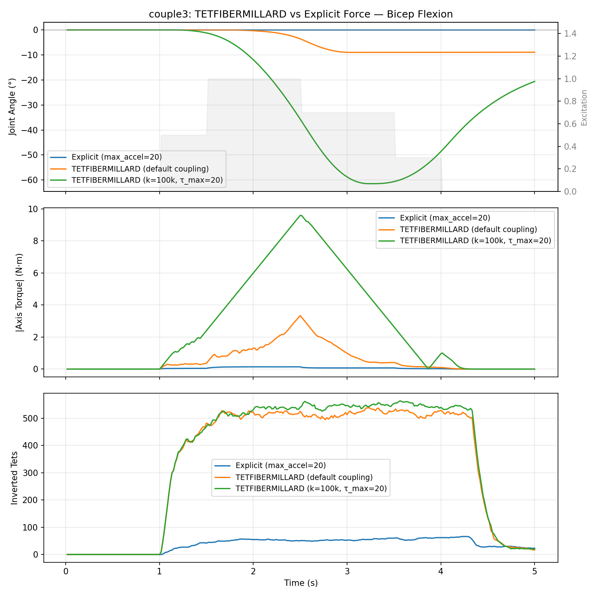
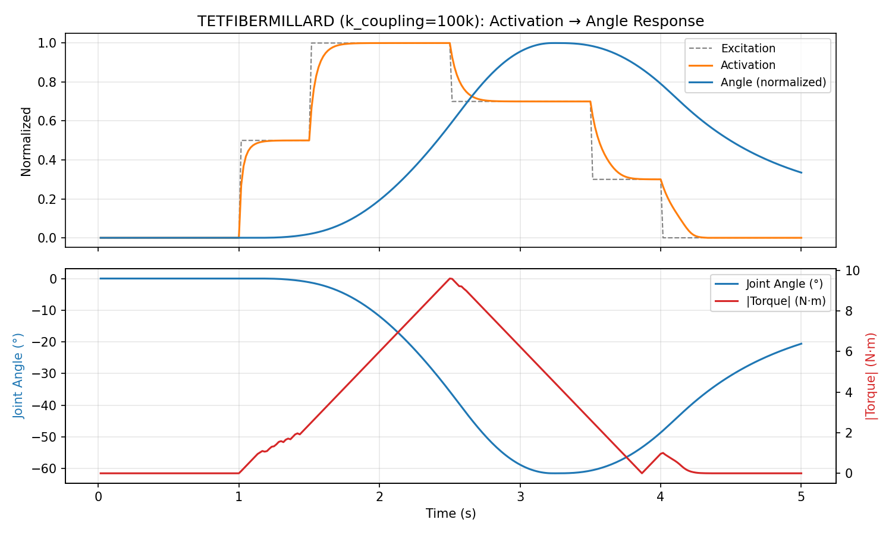

# couple3 方法对比实验

> 相关文档:
> - [初始实现](2026-04-03-example-couple3.md) — couple3 设计与 couple2 对比
> - [Mesh 稳定性调查](2026-04-03-couple3-mesh-stability.md) — 退化 tet 根因、force clamping
> - [Mesh 质量改善实验](2026-04-03-mesh-quality-experiments.md) — damping/TETSNH/Laplacian/targeted repair

## 背景

couple3 使用 XPBD-Millard 方法在真实 bicep mesh 上驱动肘关节屈曲。由于 bicep mesh 存在退化四面体（质量比 12095:1），explicit active fiber force（Route C）在 force clamping 后力量严重不足。本实验对比三个替代方案。

## 方案

1. **Approach 1**: 调参 — 提高 explicit force 的 max_accel，寻找稳定性与力的平衡
3. **Approach 3**: TETFIBERMILLARD 约束（Route A）— 使用已实现的 energy-based XPBD 约束
4. **Approach 4**: 混合 — TETFIBERNORM 驱动收缩 + 小量 explicit force

## 曲线对比



上图三栏分别为 joint angle、axis torque、inverted tets，灰色区域为 excitation schedule。



上图为 TETFIBERMILLARD (k_coupling=100k) 的 activation→angle 响应和 torque 曲线。

## 输出文件

- **动画 USD**: `output/example_couple3.anim.usd`（需配合 `output/example_couple3.anim.source.usd` 作为 sublayer）
- **绘图脚本**: `scripts/run_couple3_curves.py`
- **曲线图片**: `docs/imgs/couple3/approach_comparison.png`, `docs/imgs/couple3/best_config_detail.png`

## 结果

| 方案 | Config | Max Torque (N·m) | Max Angle (°) | 反转 tets | 稳定 |
|------|--------|:----------------:|:-------------:|:---------:|:----:|
| 基线: explicit max_accel=20 | bicep_xpbd_millard | 0.14 | ~0 | ~55 (1.4%) | 是（太弱） |
| Approach 1: max_accel=100 | bicep_xpbd_millard_tuned | 0.25 | ~0 | ~130 (3.3%) | 是（太弱） |
| Approach 1: max_accel=500 | — | 不定（振荡） | ~0 | ~430 (11%) | 力不连贯 |
| Approach 3: TETFIBERMILLARD k=1000 | bicep_fibermillard | 1.9 | 3.3 | ~500 (12.7%) | 是 |
| Approach 3: TETFIBERMILLARD k=10000 | bicep_fibermillard_high | 3.3 | 8.9 | ~510 (13%) | 是 |
| Approach 3: TETFIBERMILLARD k=100000 | bicep_fibermillard_vhigh | 4.0 | 12.5 | ~510 (13%) | 是 |
| **Approach 3: TETFIBERMILLARD k=10000 + k_coupling=100k** | **bicep_fibermillard_coupled** | **9.6** | **61** | **~550 (14%)** | **是** |
| Approach 3: σ₀=1MPa, k=10000 | bicep_fibermillard_strong | 2.5 | 9.2 | ~510 (13%) | 是 |
| Approach 4: Hybrid TETFIBERNORM+50kPa | bicep_hybrid | 0.21 | ~0 | ~130 (3.3%) | 是（太弱） |

## 关键发现

### TETFIBERMILLARD（Route A）是最优方案

- **Explicit force（Route C）根本无法工作**: 在退化 mesh 上，acceleration clamping 必须非常激进才能防止爆炸，导致 force 贡献几乎为零。即使提高 max_accel 到 500，force 方向变得不连贯。
- **TETFIBERMILLARD 天然稳定**: 作为 XPBD position-based 约束，不存在 explicit force 的不稳定问题。~14% 反转 tets 是 mesh 质量的固有限制。
- **Hybrid 方案无价值**: TETFIBERNORM 的 position correction + explicit force 的 vertex pushing 互相竞争，结果不如单独使用任何一种方法。

### 关键瓶颈是 k_coupling，不是约束 stiffness

默认 k_coupling=24000 和 max_torque=6.5 限制了 ATTACH 反力到骨骼的传递。将 k_coupling 提高到 100000 并放宽 max_torque=20 后，TETFIBERMILLARD 成功驱动 61° 屈曲。

约束 stiffness 在 10000-100000 范围内饱和（4.0 vs 3.3 N·m），增加 sigma0 到 1MPa 反而降低了 torque。

### 反转 tets 是 mesh 质量的基线问题

所有驱动明显收缩的方案都产生 ~500 反转 tets（13%），这些反转集中在 tet 3637、3807 等退化四面体上。改善需要 remesh。

## 最佳配置

```
config: bicep_fibermillard_coupled.json
  TETFIBERMILLARD: stiffness=10000, sigma0=300kPa, contraction_factor=0.4
  k_coupling: 100000
  max_torque: 20.0
```

运行命令：
```bash
uv run python examples/example_couple3.py --auto --steps 300 --k-coupling 100000 --max-torque 20
```

## TETFIBERMILLARD 行为 (k_coupling=100k, max_τ=20, 300 steps)

| Step | Activation | Joint Angle (°) | Torque (N·m) | 反转 tets |
|------|:----------:|:----------------:|:------------:|:---------:|
| 50 | 0.00 | 0.0 | 0.00 | 0 |
| 75 | 0.50 | -0.07 | 1.33 | ~400 |
| 100 | 1.00 | -3.2 | 3.60 | ~520 |
| 125 | 1.00 | -15.1 | 6.60 | ~540 |
| 150 | 1.00 | -35.6 | 9.60 | ~540 |
| 175 | 0.70 | -56.4 | 6.84 | ~548 |
| 200 | 0.70 | -61.4 | 3.84 | ~557 |
| 225 | 0.30 | -56.5 | 0.84 | ~545 |
| 250 | 0.07 | -41.8 | 0.25 | ~547 |
| 275 | 0.00 | — | 0.00 | ~65 |

## 当前问题

### Mesh 畸变过大

相比 example_couple2（TETFIBERNORM），couple3 的 TETFIBERMILLARD 在最佳配置下仍产生 ~550 反转 tets（14%），而 couple2 仅约 1-3%。原因：

- TETFIBERMILLARD 的 energy-based 收缩力更强（9.6 N·m vs couple2 的更温和力），对退化四面体施加更大变形
- Bicep mesh 固有的退化 tets（质量比 12095:1）在大收缩下必然反转
- 约束 stiffness 提高到 100000 时 torque 仅从 3.3→4.0 N·m，但反转 tets 不减反增

**否决 remesh 方案**：remeshing 会引入新的问题（mesh 拓扑变化影响 mask、attach 约束等），得不偿失。

## 下一步

1. ~~Approach 1 (explicit force tuning)~~ — 放弃
2. ~~Approach 4 (hybrid)~~ — 放弃
3. **TETFIBERMILLARD + 合适 coupling 参数** — 采用
4. ~~remesh bicep~~ — 否决，会引入更多问题
5. **降低 mesh 畸变**：探索约束参数调优（降低 contraction_factor、增加 volume constraint stiffness、调整 substep 数）或对退化 tets 做局部 stiffness 加权，在保持足够 torque 的同时减少反转
6. 精调 coupling 参数（k_coupling, max_torque, EMA smoothing）
7. 考虑 controllability preset 专为 fibermillard 优化
